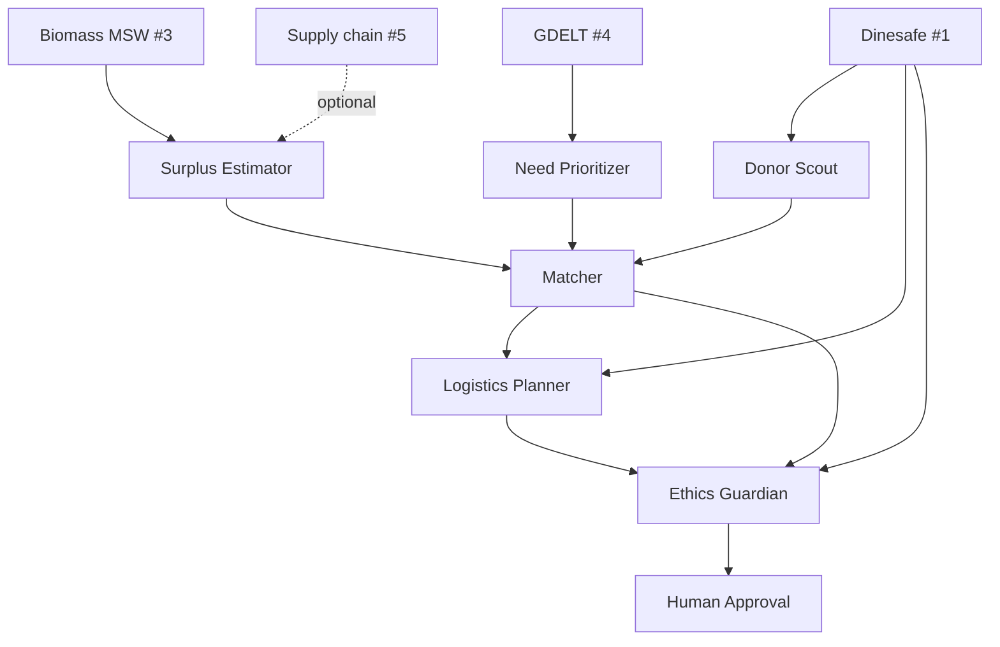

# FoodBridge — Datasets & Agents Guide

Toronto-focused setup **after dropping Montreal (#2)** — one city, four datasets, six agents.

---

## The 4 Datasets — What Each One Is For

| Dataset | Plain-language purpose | Answers this question |
|---------|------------------------|------------------------|
| **1. Toronto Dinesafe** | List of food businesses + inspection status + location | *Who can safely donate food, and where are they?* |
| **3. Canada Biomass MSW** | Organic waste volume by geographic grid cell | *Which areas have high food/organic waste pressure?* |
| **4. GDELT food security** | News/events about hunger, shelters, food banks | *Where is food need urgent right now?* |
| **5. Global food supply chain** | Production, transport, disruptions in the food chain | *Why might surplus food appear (delays, overstock, disruptions)?* |

**Important:** All four support a **Toronto-focused** story. None of them are mixed across cities.

---

## The 6 Agents — Which Dataset Each Uses

| Agent | Dataset(s) it uses | What it does with the data |
|-------|-------------------|----------------------------|
| **1. Surplus Estimator** | **Biomass (#3)** + optionally **Supply chain (#5)** | Scores how likely an area is to have surplus food. Biomass = high organic waste in that grid. Supply chain = extra signal when disruptions mean more unsold inventory. |
| **2. Need Prioritizer** | **GDELT (#4)** | Reads food-security news/events, groups by Toronto/GTA area, ranks which neighborhoods need food most urgently. |
| **3. Donor Scout** | **Dinesafe (#1)** | Finds restaurants/grocers/cafeterias. Keeps only Pass / Conditional Pass. Filters by area if needed. |
| **4. Matcher** | **All four (indirectly)** | Combines surplus score + need priority + safe donors + distance → best donor → kitchen pairs. Does not re-read raw CSVs; uses outputs from agents 1–3. |
| **5. Logistics Planner** | **Dinesafe (#1)** | Uses donor lat/long (and kitchen locations) to order pickups and estimate route distance/time. |
| **6. Ethics Guardian** | **Dinesafe (#1)** + match results | Checks safety (inspection status), fairness (small vs chain donors), transparency (logs every decision). Flags cases needing human approval. |

---

## Dataset → Agent Map (Quick View)

```
Dataset 1 (Dinesafe)        → Donor Scout, Logistics Planner, Ethics Guardian
Dataset 3 (Biomass)         → Surplus Estimator
Dataset 4 (GDELT)           → Need Prioritizer
Dataset 5 (Supply chain)    → Surplus Estimator (optional boost)
                              Matcher uses all agents' outputs
```

---

## How the Agents Work Together (Step by Step)

Think of it like an assembly line. Each agent does one job, then passes results to the next.

```
Step 1: Surplus Estimator
        Uses Biomass (+ optional supply chain)
        → "Downtown and Harbourfront have high organic waste pressure"

Step 2: Need Prioritizer
        Uses GDELT
        → "Regent Park has the highest food-insecurity signals this week"

Step 3: Donor Scout
        Uses Dinesafe
        → "Here are 12 safe Toronto donors; exclude failed inspections"

Step 4: Matcher
        Uses outputs from Steps 1–3
        → "Regent Park Cafe → Regent Park Food Hub (close, safe, high surplus)"
        → "MegaMart deferred — chain already got too many pickups"

Step 5: Logistics Planner
        Uses Dinesafe coordinates
        → "Pickup order: Cafe → Kitchen → next stop… ~12 km, ~66 min"

Step 6: Ethics Guardian
        Uses Dinesafe status + match list
        → "Fairness 0.9. 1 safety flag. Human must approve before dispatch."
```

Then a **human coordinator** approves the plan before anything is sent out.

---

## Visual Workflow



---

## Concrete Example (One Run)

**Inputs:** Tuesday evening, Toronto

| Agent | Reads | Produces |
|-------|-------|----------|
| Surplus Estimator | Biomass grid near downtown | "Regent Park surplus pressure: 82%" |
| Need Prioritizer | GDELT events | "Regent Park priority score: 8.5" |
| Donor Scout | Dinesafe | "Regent Park Cafe — Pass, 0.3 km from hub" |
| Matcher | All above | Match score 0.95, approved |
| Logistics Planner | Cafe + hub coordinates | 2 stops, 0.3 km |
| Ethics Guardian | Pass status, no chain cap hit | Approved; human sign-off still required |

---

## What Each Dataset Does NOT Do

| Dataset | Don't use it for |
|---------|------------------|
| **Dinesafe** | Measuring hunger or waste volume — it's only donors + safety |
| **Biomass** | Naming specific restaurants — it's area-level waste, not business names |
| **GDELT** | Proving a restaurant has surplus tonight — it's need/demand signals |
| **Supply chain** | Exact Toronto pickup routes — it's chain-level context, not local ops |

You combine them: **Biomass + GDELT = where and why to act**; **Dinesafe = who to contact safely**.

---

## One Sentence for Your Presentation

> **Biomass** finds waste hotspots, **GDELT** finds hunger hotspots, **Dinesafe** finds safe donors, and our six agents turn those into a fair pickup plan — with an ethics agent and a human making the final call.

---

## Why We Dropped Montreal (#2)

Toronto Dinesafe and Montreal waste data are from **different cities** and cannot be joined for matching. Using them together would be geographically invalid. Canada Biomass covers surplus pressure at grid level and can be filtered to Toronto instead.
